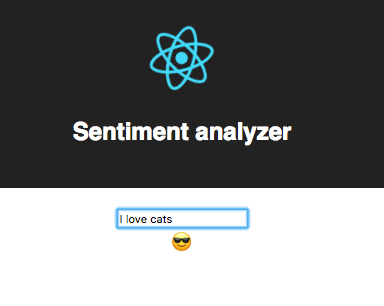

# Sentiment Analyzer APP

> Sample multi-tier application to evaluate Kubernetes.

## Requirement

To use this infrastructure locally, [`minikube`](https://github.com/kubernetes/minikube#installation) is recommended.

## Usage

⚠️ [`Task`](https://github.com/go-task/task#installation) is required to run dev and build tasks needed for this project.

🛠 `task build`: Build the docker container for the frontend and the backend
🏃‍♂️ `task run`: Run both containers
🗑 `task cleanup`: Stop and remove both containers
📝 `task logs`: Display logs for both containers